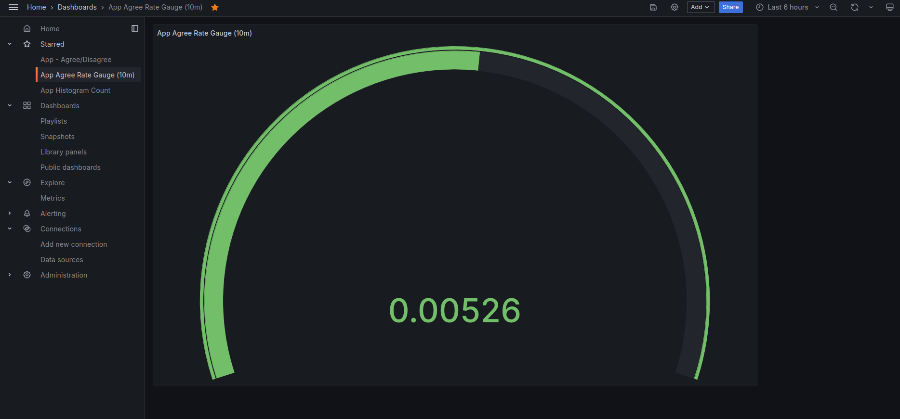
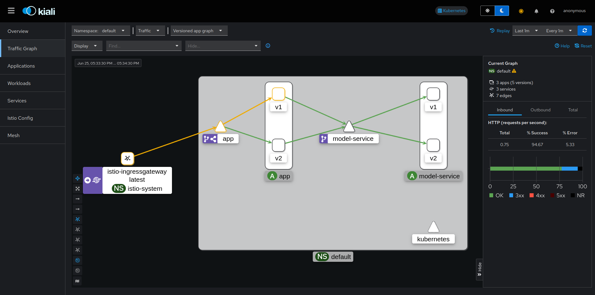

# Operation
This repository is the main repository of [remla24-team7](https://github.com/remla24-team7/) for the **CS4295 Release Engineering for Machine Learning Applications** course. This repository combines multiple applications and will deploy, test and monitor them using Release Engineering principles taught in the course. 

## Architecture

### [model-training](https://github.com/remla24-team7/model-training)
This repository contains the ML training pipeline, along with code quality and ML tests. The resulting model is stored in Google Drive and can be obtained using [dvc](https://dvc.org/).

### [model-service](https://github.com/remla24-team7/model-service)
This service wraps the released ML model and offers a REST API to expose the model to other components, making it scalable. The `model-service` embeds the ML model in a Flask webservice, allowing it to be queried via REST, and depends on [lib-ml](https://github.com/remla24-team7/lib-ml) for query pre-processing.

### [lib-ml](https://github.com/remla24-team7/lib-ml)
This library contains the pre-processing logic for data used in training or queries.

### [app](https://github.com/remla24-team7/app)
The application consists of a frontend and a service. It queries the [model-service](https://github.com/remla24-team7/model-service) through REST requests and depends on [lib-version](https://github.com/remla24-team7/lib-version).

### [lib-version](https://github.com/remla24-team7/lib-version)
A version-aware library that can be queried for the library's version.


## Installation
This project uses Vagrant to provision virtual machines and Kubernetes to manage containerized deployments. This installation guide works for Linux.

### Prerequisites

- Ansible installed (https://www.ansible.com/)
```bash
pip install ansible
```
- Vagrant installed (https://developer.hashicorp.com/vagrant/tutorials/getting-started/getting-started-install)
- Docker installed (https://www.docker.com/)
- Kubernetes installed (https://kubernetes.io/releases/download/)
- Istio installed (https://istio.io/latest/docs/setup/install/istioctl/)

This project uses `dvc` to version control data stored on Google Drive. Install `dvc` with the following commands:

```bash
    pip install dvc
    pip install dvc-gdrive
```

Before you get started make sure to `dvc pull` to obtain all the files required that will be mounted to the `model-service` pod (`encoder.joblib`, `model.keras`, `tokenizer.joblib`).

We will provide two methods to launch the application, one with Kubernetes, and one with docker compose.

## Launch application with Kubernetes
Vagrant allows us to provision three virtual machines **`controller`, `node1` and `node2`** which can be run with the following command:

    vagrant up

Vagrant creates the VMs according to the [Vagrantfile](Vagrantfile) and uses the [Ansible playbook](ansible/playbook.yml) to set up a Kubernetes (k3s) cluster with Helm, Prometheus, Grafana, Kiali and Kubernetes Dashboard installed.

The `kubeconfig` should be available on the host at `${VAGRANT_SYNCED_FOLDER:-.}/k3s.yaml`. Either set the `KUBECONFIG` environment variable or use `--kubeconfig` flags in subsequent commands.

### Expose the dashboards

    kubectl apply -f kubernetes/monitoring/expose-dashboards.yml

- Prometheus should be reachable at http://192.168.56.110:30010
- Grafana should be reachable at http://192.168.56.110:30020
- Kubernetes Dashboard should be reachable at https://192.168.56.110:30030

### Create the ClusterAdmin user and generate a Bearer token to access Kubernetes Dashboard

    kubectl apply -f kubernetes/monitoring/cluster-admin.yml
    kubectl -n monitoring create token admin

### Deploy the `app` and `model-service`

Make an entry in `/etc/hosts`: `192.168.56.110 app.remla.local`

Make sure the model folder (`model/model.keras`, `model/tokenizer.joblib`, `model/encoder.joblib`) is in `${VAGRANT_SYNCED_FOLDER:-.}`.

    kubectl apply -f kubernetes/app.yml

    kubectl apply -f kubernetes/model-service.yml

> Note: [unless AVX instructions are available inside the VMs, tensorflow and therefore model-service will crash](https://stackoverflow.com/questions/65780506/how-to-enable-avx-avx2-in-virtualbox-6-1-16-with-ubuntu-20-04-64bit).

### Start monitoring the application

    kubectl apply -f kubernetes/monitoring/monitoring.yml

This should deploy three pods distributed on the controller, node1 and node2. Open the Prometheus dashboard and move on to Status >> Targets to find the metrics endpoint. 

To add the dashboard, navigate to the Grafana dashboard at http://192.168.56.110:30020. 

The login credentials are:

login: *admin*

password: *prom-operator*

Now add Prometheus as a data source (Configuration > Data sources), the URL for Prometheus is http://192.168.56.110:30010

Import our dashboards by clicking on Dashboards > New > New Dashboard > Import a dashboard

Our dashboards containing the gauge, counter and histogram metric are located here: [Gauge dashboard](./kubernetes/monitoring/remla24-team7-monitoring-counter.json), [Counter dashboard](./kubernetes/monitoring/remla24-team7-monitoring-counter.json), [Histogram dashboard](./kubernetes/monitoring/remla24-team7-monitoring-histogram.json).

Copy the JSON file for each dashboard separately and paste them into the text box. Finally, click on load to import the dashboard. 

If everything worked correctly, you should see something like this:




## Istio Service Mesh
The Istio service mesh can be applied through the K3S cluster, or through Minikube. Instructions are provided for both methods.
### 1. Running instructions for K3S

Kiali has already been provisioned through the Ansible playbook, to apply Prometheus and Jaeger for Kiali: please navigate to your local Istio installation and run the following commands:

    kubectl label ns default istio-injection=enabled
    kubectl apply -f {istio install}/samples/addons/prometheus.yaml
    kubectl apply -f {istio install}/samples/addons/jaeger.yaml
    kubectl apply -f kubernetes/launch.yml

The virtual machines have a tendency to crash, so you might need to restart `vagrant up` if your VMs lose connection. In that case, delete and reapply `kubernetes/monitoring/expose-dashboards.yml` and `kubernetes/launch.yml`

To open the Kiali dashboard navigate to: https://192.168.56.110:30040

Wait until the `app` pod in the default namespace is up and healthy and the navigate to 'Traffic Graph' in the Kiali Dashboard. In a separate tab, open http://app.remla.local (assuming you added this to your `/etc/hosts`). Now refresh the page a couple of times and go back to the Kiali Dashboard. You should see some https traffic coming into the `app` pod via the `istio-ingressgateway` which should look something like this:



#### Traffic management
The above image shows how we implemented a second deployment of the `app` and `model-service` and added a 90/10 routing for the `app` service. A *VirtualService* is defined to match HTTP requests that come from services with a `version: v1` label and reroute these to the `v1` subset. If you find that both versions of the `model-service` pods are not starting up, it might be that the node on which they are deployed is *NotReady*. In that case restart the VMs by doing `vagrant up` and check again.

## Rate limiting in Istio

Istio provides a neat way to enable rate limiting using Envoy and its EnvoyFilter resource. We have defined a local rate limit that limits http traffic to the `app`. The local rate limit's filter [token bucket](https://www.envoyproxy.io/docs/envoy/latest/api-v3/extensions/filters/http/local_ratelimit/v3/local_rate_limit.proto#envoy-v3-api-field-extensions-filters-http-local-ratelimit-v3-localratelimit-token-bucket) is set to 20 requests, and is refilled with 10 requests every 30 seconds. To apply the local rate limiter:

    kubectl apply -f kubernetes/ratelimit.yml

To verify this, open http://app.remla.local and refresh the page 21 times. After the 21st time you should be blocked from accessing the app and see the message: **local_rate_limited**


---
## Instructions for weekly assignments

<details>
<summary> This contains the same instructions as above, but separated for each weekly assignment.</summary>

## A2: Launch application with docker compose

We provide three Compose configurations:

To use our image releases:
    docker compose up  

To build from Dockerfiles on the remote `main` branches:
    docker compose -f docker-compose.git.yml up --build

To build from Dockerfiles in locally cloned repositories.
    docker compose -f docker-compose.local.yml up --build

## A3: Vagrant/Kubernetes

### Provision the VMs

`vagrant up`

Vagrant creates the VMs according to the [Vagrantfile](Vagrantfile) and uses the [Ansible playbook](ansible/playbook.yml) to set up a Kubernetes (k3s) cluster with Helm, Prometheus, Grafana, and Kubernetes Dashboard installed.

The `kubeconfig` should be available on the host at `${VAGRANT_SYNCED_FOLDER:-.}/k3s.yaml`. Either set the `KUBECONFIG` environment variable or use `--kubeconfig` flags in subsequent commands.

### Expose the dashboards

`kubectl apply -f kubernetes/monitoring/expose-dashboards.yml`

- Prometheus should be reachable at http://192.168.56.110:30010
- Grafana should be reachable at http://192.168.56.110:30020
- Kubernetes Dashboard should be reachable at https://192.168.56.110:30030
- Kiali Dashboard should be reachable at https://192.168.56.110:30040

### Create the ClusterAdmin user and generate a Bearer token to access Kubernetes Dashboard

`kubectl apply -f kubernetes/monitoring/cluster-admin.yml`

`kubectl -n monitoring create token admin`

### Deploy the `app` and `model-service`

Make an entry in `/etc/hosts`: `192.168.56.110 app.remla.local`

Make sure the model folder (`model/model.keras`, `model/tokenizer.joblib`, `model/encoder.joblib`) is in `${VAGRANT_SYNCED_FOLDER:-.}`.

`kubectl apply -f kubernetes/app.yml`

`kubectl apply -f kubernetes/model-service.yml`

> Note: [unless AVX instructions are available inside the VMs, tensorflow and therefore model-service will crash](https://stackoverflow.com/questions/65780506/how-to-enable-avx-avx2-in-virtualbox-6-1-16-with-ubuntu-20-04-64bit).

### Start monitoring the application

    kubectl apply -f kubernetes/monitoring/monitoring_example.yml

This should deploy three pods distributed on the controller, node1 and node2. Open the Prometheus dashboard and move on to Status >> Targets to find the metrics endpoint. 

To add the dashboard, navigate to the Grafana dashboard at http://192.168.56.110:30020. 

To obtain the password for the Grafana dashboard run the following command:

    kubectl get secret --namespace monitoring grafana -o jsonpath="{.data.admin-password}" | base64 --decode ; echo

The login credentials are:

login: admin

password: *generated from command above*

Now add Prometheus as a data source (Configuration > Data sources), the URL for Prometheus is http://192.168.56.110:30010

And add the JSON dashboard located in `kubernetes/monitoring/remla24-team7-dashboard.json`

## A5: Istio Service Mesh
The Istio service mesh can be applied through the K3S cluster, or through Minikube. Instructions are provided for both methods.
### 1. Running instructions for K3S

Kiali has already been provisioned through the Ansible playbook, to apply Prometheus and Jaeger for Kiali: please navigate to your local Istio installation and run the following commands:

    kubectl label ns default istio-injection=enabled
    kubectl apply -f {istio install}/samples/addons/prometheus.yaml
    kubectl apply -f {istio install}/samples/addons/jaeger.yaml
    kubectl apply -f kubernetes/launch.yml

The virtual machines have a tendency to crash, so you might need to restart `vagrant up` if your VMs lose connection. In that case, delete and reapply `kubernetes/monitoring/expose-dashboards.yml` and `kubernetes/launch.yml`

To open the Kiali dashboard navigate to: https://192.168.56.110:30040

Wait until the `app` pod in the default namespace is up and healthy and the navigate to 'Traffic Graph' in the Kiali Dashboard. In a separate tab, open http://app.remla.local (assuming you added this to your `/etc/hosts`). Now refresh the page a couple of times and go back to the Kiali Dashboard. You should see some https traffic coming into the `app` pod via the `istio-ingressgateway` which should look something like this:


#### Traffic management
The above image shows how we implemented a second deployment of the `app` and `model-service` and added a 90/10 routing for the `app` service. A *VirtualService* is defined to match HTTP requests that come from services with a `version: v1` label and reroute these to the `v1` subset. If you find that both versions of the `model-service` pods are not starting up, it might be that the node on which they are deployed is *NotReady*. In that case restart the VMs by doing `vagrant up` and check again.

### 2. Running instructions for Minikube
```
minikube start
istioctl install
kubectl apply -f {istio install}/samples/addons/prometheus.yaml
kubectl apply -f {istio install}/samples/addons/jaeger.yaml
kubectl apply -f {istio install}/samples/addons/kiali.yaml
kubectl apply -f kubernetes/launch.yml

minikube tunnel
```

To then open the kiali dashboard

```
istioctl dashboard kiali
```

## Rate limiting in Istio

Istio provides a neat way to enable rate limiting using Envoy and its EnvoyFilter resource. We have defined a local rate limit that limits http traffic to the `app`. The local rate limit's filter [token bucket](https://www.envoyproxy.io/docs/envoy/latest/api-v3/extensions/filters/http/local_ratelimit/v3/local_rate_limit.proto#envoy-v3-api-field-extensions-filters-http-local-ratelimit-v3-localratelimit-token-bucket) is set to 20 requests, and is refilled with 10 requests every 30 seconds. To apply the local rate limiter:

    kubectl apply -f kubernetes/ratelimit.yml

To verify this, open http://app.remla.local and refresh the page 21 times. After the 21st time you should be blocked from accessing the app and see the message: **local_rate_limited**


</details>