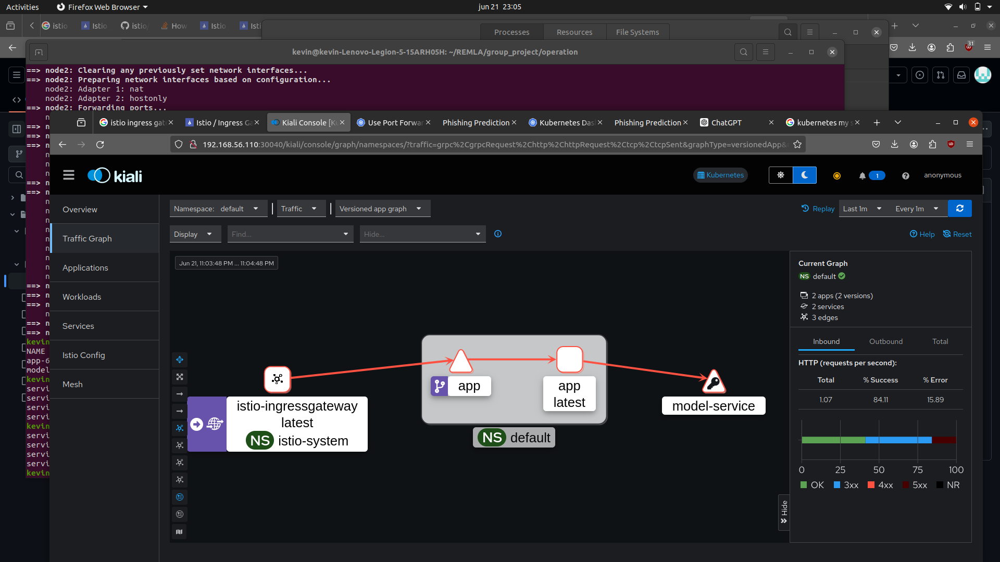
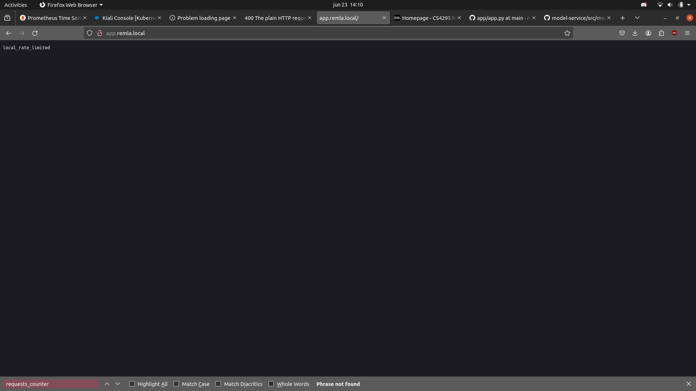

# operation

Before you get started make sure to `dvc pull` the [model.dvc](model.dvc).

## A2: Docker Compose

We provide three Compose configurations:

`docker compose up` to use our image releases.

`docker compose -f docker-compose.git.yml up --build` to build from Dockerfiles on the remote `main` branches.

`docker compose -f docker-compose.local.yml up --build` to build from Dockerfiles in locally cloned repositories.

## A3: Vagrant/Kubernetes

### Provision the VMs

`vagrant up`

Vagrant creates the VMs according to the [Vagrantfile](Vagrantfile) and uses the [Ansible playbook](ansible/playbook.yml) to set up a Kubernetes (k3s) cluster with Helm, Prometheus, Grafana, and Kubernetes Dashboard installed.

The `kubeconfig` should be available on the host at `${VAGRANT_SYNCED_FOLDER:-.}/k3s.yaml`. Either set the `KUBECONFIG` environment variable or use `--kubeconfig` flags in subsequent commands.

### Expose the dashboards

`kubectl apply -f kubernetes/monitoring/expose-dashboards.yml`

- Prometheus should be reachable at http://192.168.56.110:30010
- Grafana should be reachable at http://192.168.56.110:30020
- Kubernetes Dashboard should be reachable at https://192.168.56.110:30030
- Kiali Dashboard should be reachable at https://192.168.56.110:30040

### Create the ClusterAdmin user and generate a Bearer token to access Kubernetes Dashboard

`kubectl apply -f kubernetes/monitoring/cluster-admin.yml`

`kubectl -n monitoring create token admin`

### Deploy the `app` and `model-service`

Make an entry in `/etc/hosts`: `192.168.56.110 app.remla.local`

Make sure the model folder (`model/model.keras`, `model/tokenizer.joblib`, `model/encoder.joblib`) is in `${VAGRANT_SYNCED_FOLDER:-.}`.

`kubectl apply -f kubernetes/app.yml`

`kubectl apply -f kubernetes/model-service.yml`

> Note: [unless AVX instructions are available inside the VMs, tensorflow and therefore model-service will crash](https://stackoverflow.com/questions/65780506/how-to-enable-avx-avx2-in-virtualbox-6-1-16-with-ubuntu-20-04-64bit).

### Start monitoring the application

    kubectl apply -f kubernetes/monitoring/monitoring_example.yml

This should deploy three pods distributed on the controller, node1 and node2. Open the Prometheus dashboard and move on to Status >> Targets to find the metrics endpoint. 

To add the dashboard, navigate to the Grafana dashboard at http://192.168.56.110:30020. 

To obtain the password for the Grafana dashboard run the following command:

    kubectl get secret --namespace monitoring grafana -o jsonpath="{.data.admin-password}" | base64 --decode ; echo

The login credentials are:

login: admin

password: *generated from command above*

Now add Prometheus as a data source (Configuration > Data sources), the URL for Prometheus is http://192.168.56.110:30010

And add the JSON dashboard located in `kubernetes/monitoring/remla24-team7-dashboard.json`

## A5: Istio Service Mesh
The Istio service mesh can be applied through the K3S cluster, or through Minikube. Instructions are provided for both methods.
### 1. Running instructions for K3S

Kiali has already been provisioned through the Ansible playbook, to apply Prometheus and Jaeger for Kiali: please navigate to your local Istio installation and run the following commands:

    kubectl label ns default istio-injection=enabled
    kubectl apply -f {istio install}/samples/addons/prometheus.yaml
    kubectl apply -f {istio install}/samples/addons/jaeger.yaml
    kubectl apply -f kubernetes/launch.yml

You might need to restart `vagrant up` if your VMs lose connection. In that case, delete and reapply `kubernetes/monitoring/expose-dashboards.yml` and `kubernetes/launch.yml`

To open the Kiali dashboard navigate to: https://192.168.56.110:30040

Wait until the `app` pod in the default namespace is up and healthy and the navigate to 'Traffic Graph' in the Kiali Dashboard. In a separate tab, open http://app.remla.local (assuming you added this to your `/etc/hosts`). Now refresh the page a couple of times and go back to the Kiali Dashboard. You should see some https traffic coming into the `app` pod via the `istio-ingressgateway` which should look something like this:



### 2. Running instructions for Minikube
```
minikube start
istioctl install
kubectl apply -f {istio install}/samples/addons/prometheus.yaml
kubectl apply -f {istio install}/samples/addons/jaeger.yaml
kubectl apply -f {istio install}/samples/addons/kiali.yaml
kubectl apply -f kubernetes/launch.yml

minikube tunnel
```

To then open the kiali dashboard

```
istioctl dashboard kiali
```

## Rate limiting in Istio

Istio provides a neat way to enable rate limiting using Envoy and its EnvoyFilter resource. We have defined a local rate limit that limits http traffic to the `app`. The local rate limit's filter [token bucket](https://www.envoyproxy.io/docs/envoy/latest/api-v3/extensions/filters/http/local_ratelimit/v3/local_rate_limit.proto#envoy-v3-api-field-extensions-filters-http-local-ratelimit-v3-localratelimit-token-bucket) is set to 20 requests, and is refilled with 10 requests every 30 seconds. To apply the local rate limiter:

    kubectl apply -f kubernetes/ratelimit.yml

To verify this, open http://app.remla.local and refresh the page 21 times. After the 21st time you should be blocked from accessing the app and see the message: **local_rate_limited**

